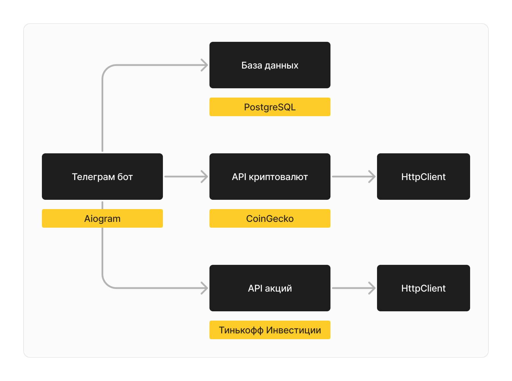

# Profitability Telegram Bot

[@waefawefwaef_bot](https://t.me/waefawefwaef_bot)

Этот бот поможет вам отслеживать ваш портфель ценных бумаг:
- Неважно, где вы покупаете и храните активы — вносите всё, чем владеете.
- Прибыльность активов отслеживается относительно момента покупки.
  - При внесении активов поделитесь датой и времем покупки, или вносите стоимость вручную.
- Поддерживается работа с несколькими покупками и/или продажами одного актива.

## Пример использования

1. Вы купили 2 акции YNDX 10 декабря 2023 года за 4674 RUB на платформе Тинькофф Инвестиции.
2. Открываете бота Profitability: вносите две купленные акции с указанием даты и времени покупки.
3. Далее вы купили еще 3 акции YNDX 12 января 2023 года за 3950 RUB на платформе ВТБ Инвестиции.
4. Вновь открываете бота Profitability: вносите три купленные акции с указанием даты и времени покупки.
5. Бот Profitability будет отслеживать ваши суммарные доходы и убытки в рублях. Бот всё посчитает относительно стоимостей активов в момент покупки!

## Скриншоты

## Архитектура

## Запуск проекта

1. Установите зависимости с помощью `pip install -r requirements.txt`.
2. Установите значения в переменные окружения. Названия переменных можно найти в `src/configs.py`.
   - На Windows это можно сделать с помощью `$Env:<key>="<value>"`. 
3. Запустите проект `python -m src.main`.
4. Готово.

## Запуск проекта с помощью Docker'а

1. Создайте сеть для контейнеров `docker network create main`.
2. Соберите проект `docker build -t profitability .`.
3. Скачайте образ PostgreSQL `docker pull postgres`.
4. Запустите контейнер с PostgreSQL `docker run -d --name postgres -e POSTGRES_USER="postgres" -e POSTGRES_PASSWORD="postgres" -e POSTGRES_DB="main" -p 5432:5432 --network=main postgres:latest`.
5. Запустите контейнер с проектом `docker run --name profitability -e CG_API_KEY="..." -e TG_BOT_TOKEN="..." -e TINKOFF_API_KEY="..." -e POSTGRES_HOST="postgres" -e POSTGRES_PORT="5432" --network=main profitability`.
6. Готово.
